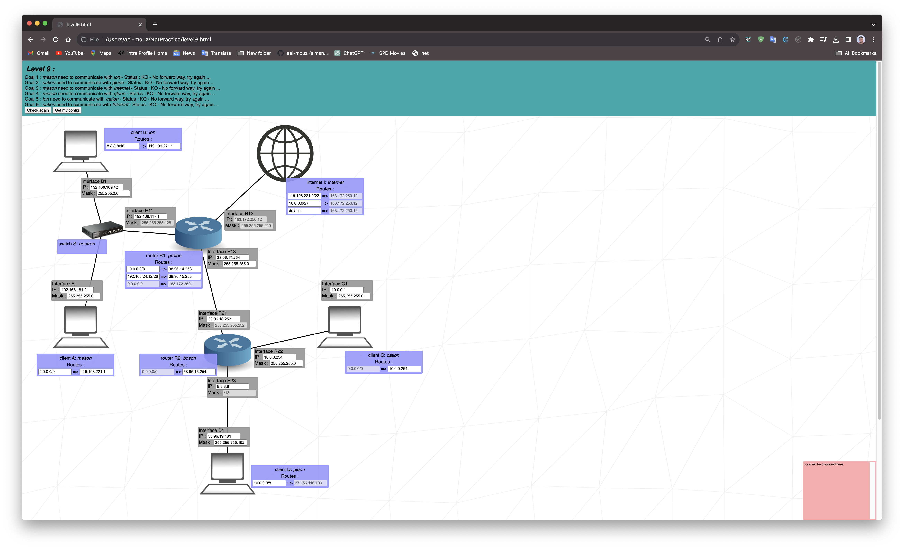
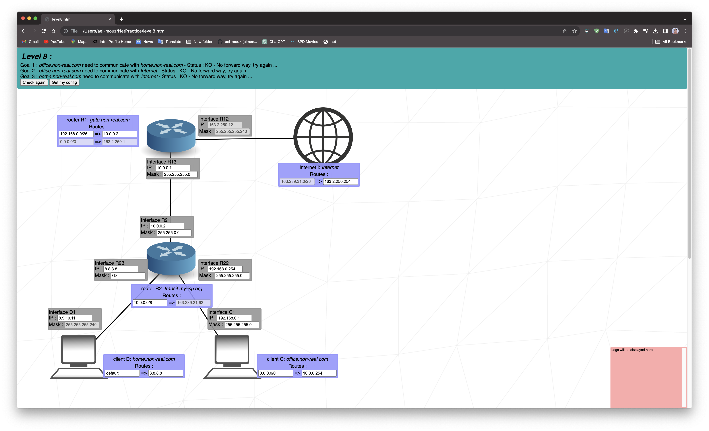

# Net_Practice

## Summary
This document is a System Administration related exercise.

## Table of Contents
- [Net\_Practice](#net_practice)
	- [Summary](#summary)
	- [Table of Contents](#table-of-contents)
	- [Introduction](#introduction)
	- [General Guidelines](#general-guidelines)
	- [Mandatory Part](#mandatory-part)
	- [What I Learned](#what-i-learned)
	- [Subject PDF](#subject-pdf)
	- [Screenshots](#screenshots)

## Introduction
This project is a general practical exercise designed to help you discover networking concepts. It includes a series of 10 exercises that allow you to configure small-scale networks, providing hands-on experience in solving networking problems and making networks run efficiently.

## General Guidelines
In this project, you are required to complete 10 levels, each representing a different networking challenge. You will need to understand how TCP/IP addressing works to successfully configure these networks. The networks are not real but are available through a training interface accessible via a web browser.

## Mandatory Part
To get started with this project, follow these steps:

1. Download the attached file from the project’s page.
2. Extract the files in a folder of your choice.
3. Run the `index.html` file. This will open the training interface in your web browser.

For detailed instructions, refer to [Chapter IV: Mandatory part](#mandatory-part) in the subject PDF.

## What I Learned
Throughout this project, you have gained valuable experience in:

- Configuring small-scale networks.
- Understanding TCP/IP addressing.
- Solving networking problems.
- Using a training interface to practice network configuration.

## Subject PDF
For detailed project instructions, please refer to the [subject.pdf](en.subject.pdf) provided in this repository.

## Screenshots

